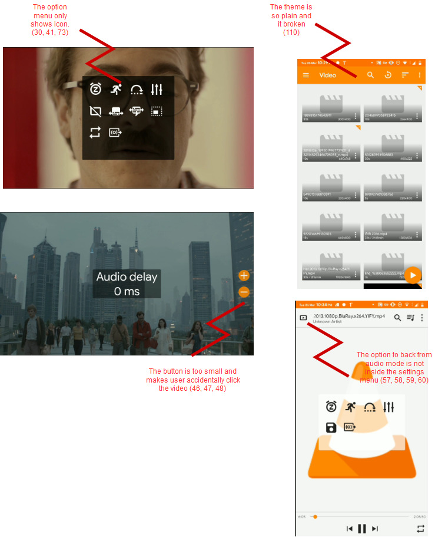

# Contextual Inquiry and Analysis

## Outline
[VLC Media Player Description](#VLC-Media-Player-Description)  
[Instruction Script](#Instruction-Script)  
[User Description](#User-Description)  
[Transcript](#Transcript)  
[Artifact Model](#Artifact-Model)
[Flow Model](#Flow-Model)  
[Cultural Model](#Cultural-Model)  
[Do's and Don't's](#Do's-and-Don't's)    

## VLC Media Player Description
VLC is a free and open source cross-platform multimedia player and framework that plays most multimedia files as well as DVDs, Audio CDs, VCDs, and various streaming protocols. VLC is one of the flexible and easy to use media player that supports wide range formats including MKV, MP4, AVI, MOV, Ogg, FLAC, TS, M2TS, Wv and AAC. 

VLC was created by VideoLAN Organization who are the non profit organization dedicated for building a good media player for everyone. It is one of the most popular media player with 3 billion downloads in all devices and platform reached in 2019. 

In Android itself, VLC Media Player has been downloaded and installed by approximately 100.000.000 people around the world with 4.4 points rating in users review and succesfully become one of the editor’s choice for Video Players and Editors in Google Play Store.

## Instruction Script
1.  Open the VLC app.
2.  Open any video with duration 10 minutes or longer.
3.  Try to set the video full screen
4.	Try to set the video to running 2 times faster.
5.	Try to reset the video playback speed.
6.	Set the audio delay for 3 mins.
7.	Play the video in audio mode.
8.	Try to set the video so it wont rotate when you rotate your phone.
9.	Try to play the video in the mode that you want to do something else like opening facebook or etc.
10.	Try to delay the subtitle for 50 ms.
11.	Try to jump to minute 30 in the video.

## User Description
- The user is a male student of Pharmacy at Airlangga University.
- The user is 20 years old.
- His name is Parisudha.
- He has experience with computer and smartphone mainly for doing his homework and surfing the internet.
- He has been using the default video media player that his smartphone gave him.
- He has experience with VLC but in other devices.

## Transcript
```
1.	A: Pernah nonton video di hp ?
2.	B: Pernah, sering.
3.	A: Biasanya beberapa kali sehari ?
4.	B: Waduh enggak ngitung pastinya, kira kira 4 video lah.
5.	A: Pake apa biasanya ?
6.	B: Pake bawaan hp yang standar.
7.	A: Pernah denger VLC ?
8.	B: Pernah tapi biasanya di laptop.
9.	A: Kalo di android ?
10.	B: Engga tau, belum pernah.
11.	A: Nah sekarang saatnya nyoba VLC wkwk.
12.	B: Oke.
13.	A: Pertama coba buka VLC di hp.
14.	(Pari mencari aplikasi VLC di hp)
15.	B: Udah, terus ?
16.	A: Coba puter video yang durasinya agak lama, 10 menit lebih.
17.	(Pari mencari video melalui menu Video di VLC)
18.	B: Udah ini.
19.	A: Darimana itu tau lebih dari 10 menit ?
20.	B: Ada tulisannya disini, 2h5m artinya 2 jam 5 menit.
21.	A: Okee. Lanjut.
22.	A: Coba puter videonya trus buat videonya full selayar.
23.	(Pari menemukan tombol untuk mengubah ukuran video)
24.	(Pari menekan tombol tersebut terus menerus hingga video memenuhi layer).
25.	A: Kenapa milih click tombol yang tadi ?
26.	B: Ya logo tombolnya ada gambar ukuran gitu.
27.	A: Oke lanjut. Coba puter videonya jadi 2 kali lebih cepet.
28.	B: Oke sebentar
29.	(Pari membuka menu pengaturan pada VLC)
30.	(Pari diam sejenak sedikit kebingungan dengan menu tersebut)
31.	(Pari menemukan tombol dengan logo gambar orang lari dan mengubah kecepatan video menjadi 2 kali secara perlahan)
32.	B: Udah.
33.	A: Okee, kenapa tadi milih tombol itu untuk mempercepat video?
34.	B: Hmmm, tadi soalnya ada gambar orang larinya jadinya nebak aja itu bisa bikin cepet atau bikin lambat wkwk.
35.	A: Okee lanjut, coba bikin audio videonya delay 3 menit
36.	B: Hmm audio..
37.	(Pari membuka menu setting, berhenti sejenak melihat kumpulan icon settings)
38.	(Setelah beberapa saat)
39.	(Pari menemukan tombol untuk mengatur delay audio)
40.	B: 3 menit ya ?
41.	A: Iya
42.	(Pari mencoba mengubah settings delay audio)
43.	(Pari beberapa kali tidak sengaja mengklik bagian video sehingga menutup menu settings VLC)
44.	(Pari kesusahan mengatur karena menu sering menghilang)
45.	A: Gimana menurut kau?
46.	B: Tadi ngubahnya manual jadinya agak susah gamau ngetik aja langsung.
47.	A: Okee wkwk. Coba sekarang ubah videonya jadi mode audio aja.
48.	B: Hmm mode audio.
49.	(Membuka menu settings dan langsung mengklik tombol untuk mode audio)
50.	B: Udah.
51.	A: Sekarang coba dikembaliin seperti semula.
52.	B: Okee
53.	(Pari membuka menu settings pada mode audio)
54.	(Pari tidak menemukan cara mengembalikan ke mode audio pada menu tersebut)
55.	(Pari membuka menu settings kembali untuk memastikan namun nihil)
56.	(Pari mencoba mengklik judul video tersebut dan tiba – tiba berhasil kembali)
57.	B: Woy wkwk tiba tiba kembali.
58.	A: Kenapa ?
59.	B: Tadi kepencet apa ga sengaja.
60.	A: Okee berarti ga ada kesusahan ya.
61.	A: Coba set videonya supaya tidak berotasi ketika kau ngerotasi hpnya.
62.	B: Oke
63.	(Pari langsung menemukan settings dengan logo gembok)
64.	A: Okee kembalin lagi. Sekarang coba buat videonya supaya tetep keputer tapi aku bisa ngelakuin hal lain seperti facebookan dll.
65.	B: Hmm bisa ya ?
66.	A: Coba aja dulu.
67.	B: Hmm
68.	(Pari bingung)
69.	(Pari mencoba membuka menu settings dan diam sejenak)
70.	(Setelah beberapa lama, pari malah tidak sengaja menutup video yang sedang diputar)
71.	B: Wah jadi keluar.
72.	A: Diulang aja lagi.
73.	(Pari mencari video kembali dan memutarnya)
74.	B: Muter video sambil muter hal lain ya hmmm
75.	(Pari menemukan settings berlogo kotak kecil dalam layer pada menu settings)
76.	(Pari menekan tombol tersebut dan VLC berubah menjadi mode picture in picture)
77.	B: Oh ini udah
78.	A: Gimana tadi ? Kenapa milih klik tombol itu ?
79.	B: Sebenernya gambar settingnya kaya tombol keluar gitu tapi masih main wkwk. Nebak aja sih.
80.	A: Okee wkwkw.
81.	A: Sekarang coba subtitlenya di mundurin 50ms.
82.	B: Okee mundurin 50 ms.
83.	(Pari membuka menu settings)
84.	(Pari menebak settings dengan logo dialog dan menekannya)
85.	B: Ohh ini.
86.	(Pari mengubah pengaturannya)
87.	A: Lanjut. Coba sekarang aku pengen ganti subtitle dari videonya.
88.	B: Okee
89.	(Pari langsung menemukan tombol untuk mengganti subtitle pada video)
90.	B: Udah ini.
91.	A: Okee lanjut ya. Sekarang coba menuju ke menit 30 dari videonya
92.	B: Okee menit 30
93.	(Pari langsung lompat dengan mengklik duration bar VLC)
94.	(Pari kesusahan menepatkan bar pada menit ke 30)
95.	(Pari menunggu 30 detik agar video berhenti tepat di menit 30).
96.	B: Udah ini.
97.	A: Manual ya tadi.
98.	B: Iya manual wkwk.
99.	A: Okee itu terakhir. Terima kasih Pari.
100.	B: Okee sama – sama.
101.	A: Gimana menurutmu mengenai aplikasi VLC ?
102.	B: Aplikasi VLC bagus ternyata, banyak fiturnya daripada video player default yang aku biasa gunain.
103.	A: Mengenai setting tadi gimana ?
104.	B: Settingnya agak gampang, menunya mudah ditebak soalnya banyak logo jadi tinggal dicoba-coba. Tapi tadi ada beberapa bingung.
105.	A: Ada saran buat VLC ?
106.	B: Hmm mungkin temanya ya wkwk soalnya datar gitu orange putih trus videonya gak keliatan.
107.	A: Okee wkwk terima kasih.

Information
A: Me
B: Parisudha

```
## Models and Annotations
### Artifact Model

### Flow Model

### Cultural Model

## Do's and Don't's
Fusce lobortis massa mauris, in aliquam erat aliquet eget. Donec rhoncus venenatis mauris, at commodo odio bibendum ac. Sed consectetur enim justo, vitae maximus eros elementum non. Sed feugiat orci sem, vel faucibus sem aliquet sed. Praesent pulvinar felis eget nisl varius, id lacinia urna pretium. Sed at ornare diam, nec fringilla dolor. In ut gravida sapien, eget varius magna. Morbi lobortis ex eu eleifend finibus. Phasellus eget nulla ullamcorper, ullamcorper purus ac, luctus turpis. Sed volutpat mauris ut erat consectetur, in sagittis erat egestas.
